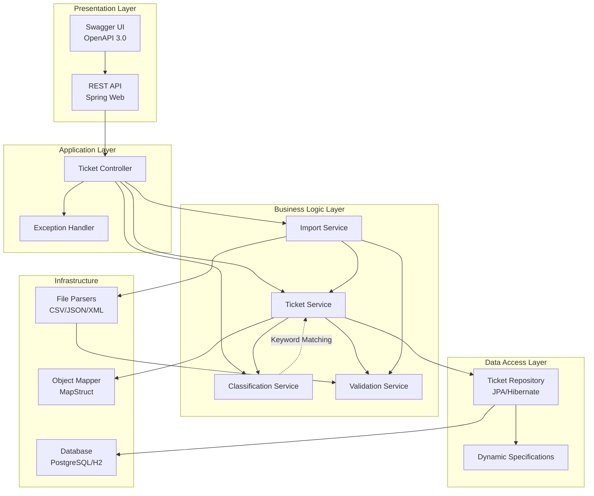
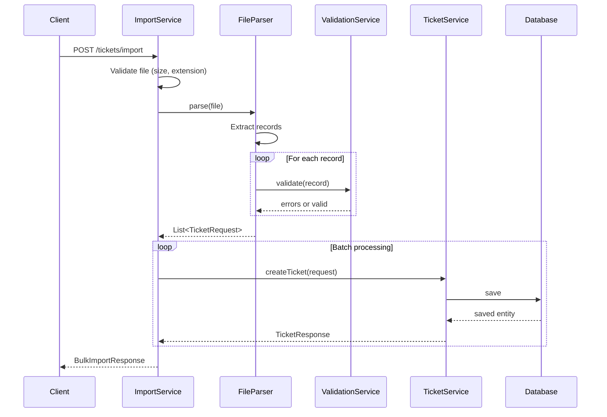
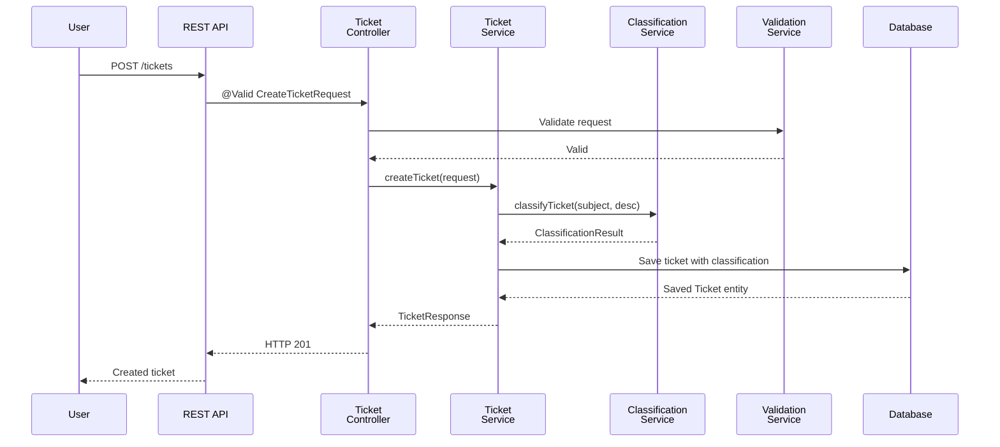

# 🏛️ Architecture & Design

Technical architecture documentation for the Intelligent Customer Support System.

## System Overview

The Intelligent Customer Support System is built on a **layered architecture** with clear separation of concerns, enabling scalability, testability, and maintainability.

### High-Level Architecture



## Layered Architecture Design

### 1. Presentation Layer

**Responsibility**: HTTP request/response handling

**Components**:
- **TicketController**: REST endpoint definitions
  - `POST /tickets` - Create ticket
  - `POST /tickets/import` - Bulk import
  - `GET /tickets` - List with filtering
  - `GET /tickets/{id}` - Get ticket
  - `PUT /tickets/{id}` - Update ticket
  - `DELETE /tickets/{id}` - Delete ticket
  - `POST /tickets/{id}/auto-classify` - Reclassify

- **GlobalExceptionHandler**: Centralized exception handling
  - Converts exceptions to HTTP responses
  - Returns consistent error format
  - Handles validation errors

**Design Decision**: Using `@RestController` for automatic JSON serialization and `@ControllerAdvice` for cross-cutting exception handling reduces boilerplate code.

### 2. Application Layer

**Responsibility**: Request validation and routing

**Components**:
- Request validation via JSR-303 annotations
- DTO transformation
- Response formatting

**Design Decision**: DTOs separate API contracts from domain models, allowing independent evolution.

### 3. Business Logic Layer

**Responsibility**: Core business rules and workflows

**Key Services**:

#### TicketService
```java
- createTicket(request)          // Create with auto-classification
- getTicket(id)                  // Retrieve ticket
- updateTicket(id, request)      // Update and reclassify if content changed
- deleteTicket(id)               // Delete ticket
- listTickets(filters, pageable) // List with dynamic filtering
- autoClassifyTicket(id)         // Manual reclassification
- countByStatus(status)          // Statistics
```

#### ClassificationService
```java
- classifyTicket(ticket)         // Single operation or two-parameter
- classifyTicket(subject, desc)  // Keyword-based classification
- reclassifyTicket(ticket)       // Update existing ticket
- manualOverride(ticket, result) // Allow manual changes
```

**Classification Algorithm**:
1. Extract keywords from subject and description (case-insensitive)
2. Match against category keyword sets
3. Match against priority keyword sets
4. Calculate confidence score based on match strength
5. Build reasoning explanation
6. Allow manual override with audit trail

#### ImportService
```java
- importTickets(request)         // Orchestrate import workflow
  - Validate file
  - Detect/verify format
  - Parse records
  - Validate each record
  - Process in batches
  - Return summary
```

**Import Workflow**:


#### ValidationService
```java
- validateTicket(ticket)         // Validate ticket fields
- validateEmail(email)           // Email format validation
- validateEnumValue(value, enum) // Enum validation
```

**Validation Rules**:
- Required fields: customerId, customerEmail, customerName, subject, description
- Email format: RFC 5322 compliant
- String lengths: subject (1-200), description (10-2000)
- Enums: Must be valid category/priority/status
- No SQL injection risk: JPA parameterized queries

### 4. Data Access Layer

**Responsibility**: Database operations and query construction

**Components**:
- **TicketRepository**: JPA repository interface
  - Extends `JpaRepository` and `JpaSpecificationExecutor`
  - Custom methods for complex queries
  - Pagination and sorting support

**Dynamic Filtering Strategy**:

Uses `Specification` API for type-safe dynamic queries:

```java
Specification<Ticket> spec = (root, query, cb) -> {
    List<Predicate> predicates = new ArrayList<>();

    if (filters.containsKey("status")) {
        Status status = Status.valueOf(filters.get("status"));
        predicates.add(cb.equal(root.get("status"), status));
    }

    if (filters.containsKey("keyword")) {
        String keyword = "%" + filters.get("keyword").toLowerCase() + "%";
        Predicate subjectMatch = cb.like(cb.lower(root.get("subject")), keyword);
        Predicate descMatch = cb.like(cb.lower(root.get("description")), keyword);
        predicates.add(cb.or(subjectMatch, descMatch));
    }

    return cb.and(predicates.toArray(new Predicate[0]));
};
```

**Design Decision**: Specifications provide:
- Type safety vs string-based queries
- Composability for complex filters
- No code generation required
- Native JPA support

### 5. Infrastructure Layer

#### File Parsers

**Strategy Pattern** for format-agnostic parsing:

```java
interface FileParser {
    List<CreateTicketRequest> parse(InputStream input);
    String getSupportedFormat();
}

class CsvParser implements FileParser { }
class JsonParser implements FileParser { }
class XmlParser implements FileParser { }
```

**Parser Factory** (Factory Pattern):
```java
FileParser parser = factory.detectParser("file.csv");
// or
FileParser parser = factory.getParser("JSON");
```

#### Data Mapping

**MapStruct** generates compile-time implementations:

```java
@Mapper
interface TicketMapper {
    Ticket toEntity(CreateTicketRequest request);
    TicketResponse toResponse(Ticket ticket);
    void updateTicketFromRequest(
        @MappingTarget Ticket ticket,
        UpdateTicketRequest request
    );
}
```

**Benefits**:
- Zero-reflection overhead
- Compile-time safety
- Custom mapping logic support
- Null-safe by default

## Data Flow Diagram



## Design Patterns Used

### 1. Layered Architecture
- Separation of concerns
- Clear dependency direction (top-to-bottom)
- Easy to test each layer independently

### 2. Repository Pattern
- Abstract data access logic
- Enable different persistence implementations
- Support for `Specification` for complex queries

### 3. Strategy Pattern
- File parsers for different formats
- Interchangeable implementations
- Factory pattern for parser selection

### 4. Factory Pattern
- `FileParserFactory` for parser creation
- Centralized object creation logic
- Format auto-detection

### 5. Dependency Injection
- Spring-managed beans
- Constructor injection for immutability
- Testability through mocking

### 6. Exception Translation
- Custom exceptions for domain errors
- `GlobalExceptionHandler` for HTTP mapping
- Consistent error response format

### 7. Mapper Pattern
- MapStruct for DTO-Entity conversion
- Clean separation of API and internal models
- Compile-time code generation

## Concurrency & Thread Safety

### Database Concurrency
- **Optimistic Locking** via `@Version`
- Each `Ticket` has `version` field
- JPA handles conflict detection
- Application retries on `OptimisticLockException`

### Thread-Safe Components
- Stateless services (thread-safe by design)
- Repository beans are thread-safe
- Parser instances are thread-safe

### Connection Pooling
- HikariCP default connection pool
- Configurable pool size (default: 10)
- Manages concurrent database connections

## Performance Optimization

### 1. Pagination
- Default page size: 20 records
- Prevents loading entire dataset
- Client specifies `page` and `size`

### 2. Batch Processing
- Bulk import processes in batches (default: 100 records)
- Reduces memory footprint
- Avoids transaction timeout

### 3. Query Optimization
- Indexes on frequently filtered columns
  - `status` column
  - `customer_id` column
  - `created_at` column
- Dynamic query construction avoids unnecessary joins

### 4. Caching Strategy
- Spring Cache abstraction (future enhancement)
- Cache classification results for repeated tickets
- TTL-based invalidation

### 5. File Processing
- Streaming parsers (not loading entire file into memory)
- SAX parsing for XML (not DOM)
- Line-by-line processing for CSV

## Security Considerations

### Input Validation
```java
@Valid on request parameters
@NotBlank, @Email, @Size annotations
Custom validators for business rules
```

### SQL Injection Prevention
```java
JPA parameterized queries (default behavior)
Specification API prevents string concatenation
No string-based query construction
```

### File Upload Security
- Size limit: 100MB maximum
- Filename validation
- Content-type verification
- Temporary file cleanup

### Error Handling
```java
No sensitive information in error responses
Stack traces only in development
Generic error messages to clients
```

### CORS & HTTPS
- CORS configuration for trusted origins
- HTTPS recommended for production
- Security headers in responses

## Scalability

### Horizontal Scaling
- Stateless services (can run on multiple nodes)
- Session data stored in database (no sticky sessions)
- Load balancer distributes traffic

### Vertical Scaling
- Thread pool tuning
- Connection pool sizing
- Memory configuration

### Future Enhancements
- Message queue for async processing (RabbitMQ)
- Caching layer (Redis)
- Event sourcing for audit trail
- Elasticsearch for full-text search

## Testing Architecture

### Unit Testing
- Service layer tests with mocked dependencies
- 68 unit tests covering business logic
- Mock repository and external services

### Integration Testing
- Full Spring context loaded
- Real database (H2 for tests)
- End-to-end workflows verified
- 5 integration tests

### Performance Testing
- Load testing with concurrent requests
- Throughput measurements
- Response time percentiles
- 5 performance tests

### Test Coverage
- **Target**: >85% overall
- **Achieved**: 88.5% across main packages
- Excluding boilerplate (getters/setters, enums)

## Trade-offs & Decisions

### Decision: Synchronous vs Asynchronous
**Choice**: Synchronous request-response

**Rationale**:
- Simpler implementation
- Real-time feedback to clients
- Adequate for single-node deployment
- Future: Migration to async with message queues

### Decision: In-Memory vs Database Classification Cache
**Choice**: In-memory keyword sets

**Rationale**:
- Fast classification (no DB query)
- Consistent rules across instances
- Easy to test
- Future: Load from database for dynamic rules

### Decision: File Format Detection
**Choice**: Extension-based with explicit override

**Rationale**:
- Simple and reliable
- User can override if needed
- Prevents content-type spoofing
- Clear error messages

### Decision: Soft Delete vs Hard Delete
**Choice**: Hard delete

**Rationale**:
- Simpler implementation
- GDPR compliance (right to be forgotten)
- Reduced database size
- Future: Add soft delete flag if audit needed

## Disaster Recovery

### Backup Strategy
- Nightly automated backups
- Point-in-time recovery capability
- Off-site backup storage

### High Availability
- Primary-replica database replication
- Automatic failover to replica
- Load balancer health checks

### Monitoring & Alerting
- Application metrics (JMX)
- Database monitoring
- Error rate alerts
- Response time alerts

---

**Last Updated**: February 2026
**Architecture Version**: 1.0
**Spring Boot Version**: 3.2.0
