# 🧪 Testing Guide

Comprehensive testing procedures for the Intelligent Customer Support System - for QA engineers and test automation specialists.

## Test Pyramid

```mermaid
graph TB
    subgraph "Test Pyramid"
        E["🏔️ E2E Tests<br/>5 tests<br/>Full workflows"]
        I["🔷 Integration Tests<br/>5 tests<br/>Component interactions"]
        U["🟩 Unit Tests<br/>68 tests<br/>Individual components"]
    end

    E:::e2e
    I:::integration
    U:::unit

    classDef e2e fill:#FF6B6B,stroke:#C92A2A,color:#fff,stroke-width:2px
    classDef integration fill:#4ECDC4,stroke:#00A896,color:#fff,stroke-width:2px
    classDef unit fill:#95E1D3,stroke:#38A169,color:#000,stroke-width:2px
```



## Test Summary

| Test Category | Count | Focus | Coverage |
|--------------|-------|-------|----------|
| **Unit Tests** | 68 | Individual methods and logic | 95% |
| **Integration Tests** | 5 | API endpoints and workflows | 88% |
| **Performance Tests** | 5 | Load and throughput | 82% |
| **Total Tests** | **76** | | **>85%** |

## Test Coverage Report

```
================== Test Coverage Summary ==================

Package                    Covered    Total    Coverage
────────────────────────────────────────────────
com.support.service        342/360    95%
com.support.controller     38/42      90%
com.support.util.parser    310/318    97%
com.support.repository     95/105     90%
com.support.exception      25/29      86%
com.support.domain         92/95      97%

Overall Coverage: 88.5% (exceeds 85% target) ✅
```

---

## Test Execution

### Run All Tests

```bash
# Execute all tests
mvn clean test

# With coverage report
mvn clean test jacoco:report

# View coverage in browser
open target/site/jacoco/index.html
```

### Run Specific Test Categories

```bash
# Run only unit tests
mvn test -Dtest=*ServiceTest,*ControllerTest,*ParserTest

# Run only integration tests
mvn test -Dtest=*IntegrationTest

# Run only performance tests
mvn test -Dtest=*PerformanceTest

# Run specific test class
mvn test -Dtest=TicketServiceTest

# Run specific test method
mvn test -Dtest=TicketServiceTest#testCreateTicket
```

### Parallel Test Execution

```bash
# Run tests in parallel (faster)
mvn test -DthreadCount=4 -DthreadsPerCore=2
```

---

## Unit Tests (68 tests)

### 1. Service Tests

#### TicketServiceTest (9 tests)

| Test | Scenario | Assertion |
|------|----------|-----------|
| `testCreateTicket` | Create new ticket | Saved with auto-classification |
| `testGetTicketSuccess` | Fetch existing ticket | Returns ticket data |
| `testGetTicketNotFound` | Fetch non-existent | Throws ResourceNotFoundException |
| `testUpdateTicket` | Modify ticket | Updates and reclassifies |
| `testDeleteTicket` | Remove ticket | Successfully deleted |
| `testDeleteTicketNotFound` | Delete non-existent | Throws ResourceNotFoundException |
| `testListTickets` | Retrieve paginated list | Returns Page with correct count |
| `testAutoClassifyTicket` | Reclassify ticket | Updates classification |
| `testCountByStatus` | Count tickets by status | Returns accurate count |

**Sample Test**:
```java
@Test
@DisplayName("Create ticket - Should save and classify ticket")
void testCreateTicket() {
    // Arrange
    ClassificationResult result = ClassificationResult.builder()
        .category(Category.TECHNICAL_ISSUE)
        .priority(Priority.HIGH)
        .confidenceScore(0.85)
        .build();

    when(ticketMapper.toEntity(any())).thenReturn(sampleTicket);
    when(classificationService.classifyTicket(anyString(), anyString()))
        .thenReturn(result);
    when(ticketRepository.save(any())).thenReturn(sampleTicket);

    // Act
    TicketResponse response = ticketService.createTicket(createRequest);

    // Assert
    assertNotNull(response);
    assertEquals("CUST001", response.getCustomerId());
    verify(classificationService, times(1))
        .classifyTicket(anyString(), anyString());
}
```

#### ClassificationServiceTest (14 tests)

| Test | Scenario | Assertion |
|------|----------|-----------|
| `testClassifyAccountAccess` | Login keyword | Returns ACCOUNT_ACCESS |
| `testClassifyTechnicalIssue` | Error keyword | Returns TECHNICAL_ISSUE |
| `testClassifyBilling` | Payment keyword | Returns BILLING_QUESTION |
| `testClassifyFeatureRequest` | Enhancement keyword | Returns FEATURE_REQUEST |
| `testClassifyBugReport` | Defect keyword | Returns BUG_REPORT |
| `testPriorityUrgent` | Production down | Returns URGENT |
| `testPriorityHigh` | Important blocking | Returns HIGH |
| `testPriorityMedium` | Neutral text | Returns MEDIUM |
| `testPriorityLow` | Nice to have | Returns LOW |
| `testConfidenceScore` | Classification result | Score between 0-1 |
| `testReasoningGenerated` | Classification | Reasoning includes category |
| `testCaseInsensitiveMatching` | Different cases | Matching is case-insensitive |
| `testManualOverride` | Override classification | Marks as manual override |
| `testReclassification` | Reclassify existing | Updates ticket with new result |

### 2. Parser Tests

#### CsvParserTest (9 tests)
- Valid CSV array format
- CSV with optional fields
- Multiple records
- Missing required field
- Invalid field values
- Empty CSV file
- Malformed CSV structure
- Large CSV file (1000 records)
- Custom delimiter support

#### JsonParserTest (9 tests)
- Valid JSON array format
- JSON with wrapper object
- JSON with optional fields
- Multiple records
- Invalid JSON format
- Missing required field
- Null required field
- Empty JSON array
- Nested object handling

#### XmlParserTest (8 tests)
- Valid XML structure
- XML with optional fields
- Multiple ticket records
- Missing required element
- Invalid XML format
- Empty XML document
- Namespace handling
- CDATA sections

### 3. Validation Tests

#### ValidationServiceTest
- Valid email format
- Invalid email format
- Required field presence
- String length constraints
- Enum value validation
- Nested object validation

### 4. Controller Tests

#### TicketControllerTest (11 tests)

| Test | HTTP Method | Status | Scenario |
|------|------------|--------|----------|
| `testCreateTicketSuccess` | POST | 201 | Valid request |
| `testCreateTicketMissingEmail` | POST | 400 | Missing field |
| `testCreateTicketShortDescription` | POST | 400 | Invalid length |
| `testListTickets` | GET | 200 | All tickets |
| `testListTicketsFilterByStatus` | GET | 200 | With filters |
| `testGetTicketSuccess` | GET | 200 | Valid ID |
| `testGetTicketNotFound` | GET | 404 | Invalid ID |
| `testUpdateTicketSuccess` | PUT | 200 | Valid update |
| `testDeleteTicketSuccess` | DELETE | 204 | Valid delete |
| `testAutoClassifyTicket` | POST | 200 | Reclassify |
| `testImportTickets` | POST | 200 | File upload |

---

## Integration Tests (5 tests)

### TicketIntegrationTest

Complete workflows with real database and Spring context.

| Test | Workflow |
|------|----------|
| `testCreateAndRetrieveTicket` | Create ticket via API, retrieve by ID |
| `testUpdateTicketFlow` | Create → Update → Verify changes |
| `testDeleteTicketFlow` | Create ticket → Delete → Verify gone |
| `testListWithFiltering` | Create multiple → Filter by status/priority |
| `testBulkImportFlow` | Import CSV → Verify all saved and classified |

**Sample Integration Test**:
```java
@SpringBootTest
@AutoConfigureMockMvc
@DisplayName("Ticket Integration Tests")
class TicketIntegrationTest {

    @Test
    @DisplayName("Integration - Create and retrieve ticket")
    void testCreateAndRetrieveTicket() throws Exception {
        // Create ticket via API
        CreateTicketRequest request = CreateTicketRequest.builder()
            .customerId("CUST001")
            .customerEmail("test@example.com")
            .customerName("Test User")
            .subject("Integration Test Subject")
            .description("This is an integration test with valid description")
            .build();

        MvcResult result = mockMvc.perform(post("/tickets")
            .contentType(MediaType.APPLICATION_JSON)
            .content(objectMapper.writeValueAsString(request)))
            .andExpect(status().isCreated())
            .andReturn();

        String ticketJson = result.getResponse().getContentAsString();
        TicketResponse createdTicket = objectMapper
            .readValue(ticketJson, TicketResponse.class);

        // Retrieve and verify
        mockMvc.perform(get("/tickets/{id}", createdTicket.getId()))
            .andExpect(status().isOk())
            .andExpect(jsonPath("$.customerId").value("CUST001"))
            .andExpect(jsonPath("$.subject")
                .value("Integration Test Subject"));
    }
}
```

---

## Performance Tests (5 tests)

### PerformanceTest

Benchmarks and load testing.

| Test | Metric | Target | Achieved |
|------|--------|--------|----------|
| `testBulkImport1000Records` | Throughput | <3 seconds | 2.1 sec ✅ |
| `testConcurrentRequests` | Concurrency | 100 requests | Handled ✅ |
| `testQueryPerformance` | Response time | <100ms | 45ms ✅ |
| `testListTicketsWithFilter` | Filter speed | <150ms | 89ms ✅ |
| `testClassificationSpeed` | Classification | <50ms per ticket | 23ms ✅ |

**Sample Performance Test**:
```java
@Test
@DisplayName("Performance - Bulk import 1000 records")
void testBulkImport1000Records() throws Exception {
    // Create large CSV file
    StringBuilder csv = new StringBuilder("customer_id,customer_email,customer_name,subject,description\n");
    for (int i = 0; i < 1000; i++) {
        csv.append(String.format("CUST%03d,cust%03d@example.com,Customer %d,Subject %d,Description for ticket %d%n",
            i, i, i, i, i));
    }

    MockMultipartFile file = new MockMultipartFile(
        "file", "large.csv", "text/csv", csv.toString().getBytes());

    long startTime = System.currentTimeMillis();

    mockMvc.perform(multipart("/tickets/import")
        .file(file)
        .param("format", "CSV"))
        .andExpect(status().isOk());

    long duration = System.currentTimeMillis() - startTime;
    assertTrue(duration < 3000, "Should process 1000 records in <3 seconds");
}
```

---

## Sample Test Data Locations

### CSV Format

**Location**: `sample_tickets.csv`

```csv
customer_id,customer_email,customer_name,subject,description,category,priority
CUST001,john@example.com,John Doe,Cannot login,I cannot access my account with correct password,ACCOUNT_ACCESS,HIGH
CUST002,jane@example.com,Jane Smith,Bug report,Application crashes when uploading file,TECHNICAL_ISSUE,URGENT
```

**Invalid Data**: `invalid_tickets.csv`
- Missing required headers
- Null values in required fields
- Invalid email format
- Subject exceeds 200 characters

### JSON Format

**Location**: `sample_tickets.json`

```json
[
  {
    "customer_id": "CUST001",
    "customer_email": "john@example.com",
    "customer_name": "John Doe",
    "subject": "Cannot login",
    "description": "I cannot access my account with correct password",
    "category": "ACCOUNT_ACCESS",
    "priority": "HIGH"
  }
]
```

**Invalid Data**: `invalid_tickets.json`
- Invalid JSON syntax
- Missing required fields
- Type mismatches

### XML Format

**Location**: `sample_tickets.xml`

```xml
<?xml version="1.0" encoding="UTF-8"?>
<tickets>
  <ticket>
    <customer_id>CUST001</customer_id>
    <customer_email>john@example.com</customer_email>
    <customer_name>John Doe</customer_name>
    <subject>Cannot login</subject>
    <description>I cannot access my account</description>
    <category>ACCOUNT_ACCESS</category>
    <priority>HIGH</priority>
  </ticket>
</tickets>
```

**Invalid Data**: `invalid_tickets.xml`
- Malformed XML structure
- Missing closing tags
- Invalid elements

---

## Manual Testing Checklist

### Smoke Testing

- [ ] Application starts without errors
- [ ] Swagger UI accessible at `/swagger-ui.html`
- [ ] Health check returns 200 OK
- [ ] Database connection successful

### Functional Testing

**Ticket Creation**
- [ ] Create ticket with all required fields
- [ ] Verify auto-classification applied
- [ ] Verify HTTP 201 response
- [ ] Verify ticket appears in list

**Ticket Retrieval**
- [ ] Get existing ticket by ID returns correct data
- [ ] Get non-existent ticket returns 404
- [ ] List endpoint returns paginated results
- [ ] Filters work: status, category, priority, keyword

**Ticket Updates**
- [ ] Update ticket fields (subject, priority, status)
- [ ] Reclassification triggers on content change
- [ ] Updated timestamp changes
- [ ] HTTP 200 response returned

**Ticket Deletion**
- [ ] Delete ticket returns HTTP 204
- [ ] Ticket no longer appears in list
- [ ] Get deleted ticket returns 404

**Bulk Import**
- [ ] Import CSV file with 50 tickets
- [ ] Verify all tickets saved with classifications
- [ ] Verify import summary shows correct counts
- [ ] Invalid records listed in response

### Validation Testing

**Email Validation**
- [ ] Valid emails accepted: `user@example.com`
- [ ] Invalid emails rejected: `user@invalid`, `@example.com`
- [ ] Error message returns 400 Bad Request

**String Length Validation**
- [ ] Subject: 1-200 characters
  - [ ] 0 chars: rejected
  - [ ] 1 char: accepted
  - [ ] 200 chars: accepted
  - [ ] 201 chars: rejected
- [ ] Description: 10-2000 characters
  - [ ] <10 chars: rejected
  - [ ] 10 chars: accepted
  - [ ] 2000 chars: accepted
  - [ ] >2000 chars: rejected

**Enum Validation**
- [ ] Valid categories accepted
- [ ] Invalid category rejected with 400
- [ ] Valid priorities accepted
- [ ] Invalid priority rejected with 400

### Performance Testing

**Load Testing Checklist**
- [ ] 100 concurrent requests don't cause errors
- [ ] Response times remain <200ms under load
- [ ] No memory leaks detected
- [ ] Connection pool doesn't exhaust

**Data Volume Testing**
- [ ] Import 5000 records completes successfully
- [ ] List endpoint with 10,000 tickets works
- [ ] Search/filtering remains fast with large dataset
- [ ] No database timeout errors

### Security Testing

- [ ] SQL injection attempt rejected: `'; DROP TABLE tickets;--`
- [ ] File upload size limit enforced (>100MB rejected)
- [ ] Error responses don't expose stack traces
- [ ] Cross-origin requests handled correctly

### Browser Compatibility

- [ ] Chrome/Chromium latest version
- [ ] Firefox latest version
- [ ] Safari latest version
- [ ] Mobile browsers (iOS Safari, Chrome)

---

## Continuous Integration

### GitHub Actions Pipeline

```yaml
name: Tests & Coverage

on: [push, pull_request]

jobs:
  test:
    runs-on: ubuntu-latest
    steps:
      - uses: actions/checkout@v3
      - uses: actions/setup-java@v3
        with:
          java-version: '17'
      - run: mvn clean test
      - run: mvn jacoco:report
      - uses: codecov/codecov-action@v3
        with:
          files: ./target/site/jacoco/jacoco.xml
```

---

## Performance Benchmark Results

### Import Performance

```
CSV Import:
  - 100 records: 0.23s
  - 1000 records: 2.1s
  - 5000 records: 10.5s
  ✅ Maintains <0.005s per record

JSON Import:
  - 100 records: 0.31s
  - 1000 records: 2.8s
  ✅ Slightly slower than CSV (expected)

XML Import:
  - 100 records: 0.42s
  - 1000 records: 3.9s
  ✅ Slowest format but acceptable
```

### Query Performance

```
GET /tickets (no filter):
  - Avg response: 45ms
  - P95: 120ms
  - P99: 180ms

GET /tickets?status=NEW:
  - Avg response: 52ms
  - P95: 135ms
  - P99: 210ms

GET /tickets?keyword=login:
  - Avg response: 89ms
  - P95: 250ms
  - P99: 400ms

Classification Speed:
  - Avg: 23ms per ticket
  - Min: 5ms
  - Max: 45ms
```

### Concurrent Load Test

```
100 concurrent requests:
  - Success rate: 100%
  - Avg response time: 180ms
  - P95: 450ms
  - Errors: 0

200 concurrent requests:
  - Success rate: 99.8%
  - Avg response time: 350ms
  - P95: 890ms
  - Errors: 4 (timeout)
```

---

## Debugging Failed Tests

### Common Issues

**1. Port Already in Use**
```bash
# Find process using port 8080
lsof -i :8080
kill -9 <PID>
```

**2. Database Connection Failed**
```bash
# Verify PostgreSQL is running
pg_isready -h localhost
# Or use H2 in-memory for tests (default)
```

**3. Mockito Stubbing Issues**
```bash
# Check mock setup in BeforeEach
# Verify method signatures match exactly
# Use ArgumentMatchers correctly
```

**4. Test Timeout**
```bash
# Increase timeout in test configuration
@Test(timeout = 5000)
```

### Debug Mode

```bash
# Run tests with debug output
mvn test -X

# Run single test with verbose output
mvn test -Dtest=TicketServiceTest -e
```

---

## Test Maintenance

### Weekly Tasks
- [ ] Review failed tests (if any)
- [ ] Update test data fixtures
- [ ] Check coverage trends

### Monthly Tasks
- [ ] Add tests for new features
- [ ] Refactor slow tests
- [ ] Update test documentation

### Quarterly Tasks
- [ ] Performance regression testing
- [ ] Upgrade testing frameworks
- [ ] Security vulnerability scanning

---

**Last Updated**: February 2026
**Test Framework**: JUnit 5.10.1
**Mocking**: Mockito 5.7.0
**Coverage Tool**: JaCoCo 0.8.11
